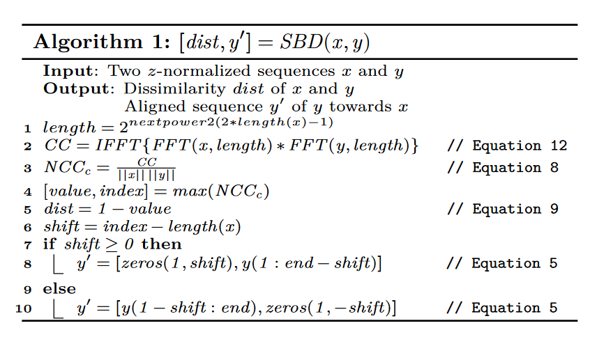
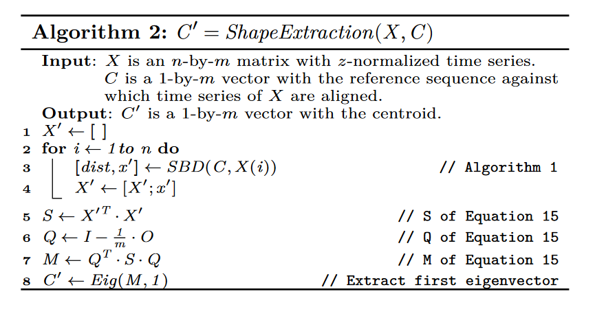
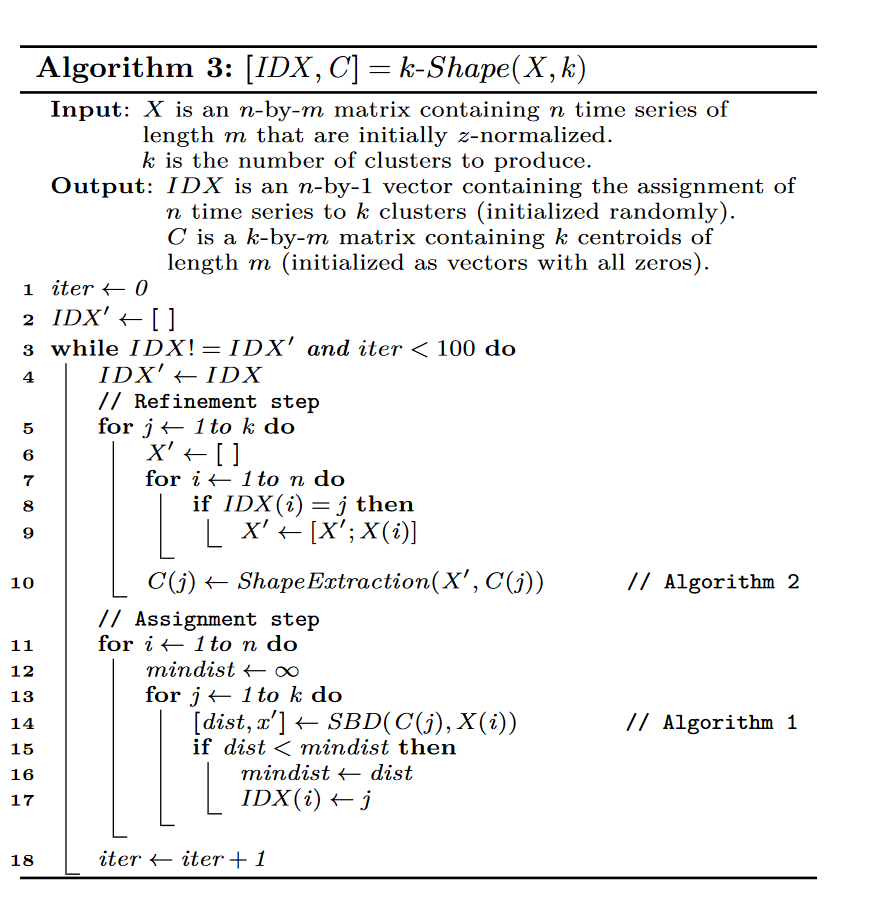

## 目录
- [目录](#目录)
- [实验总述](#实验总述)
- [初步实验](#初步实验)
  - [实验思路](#实验思路)
  - [代码实现](#代码实现)
  - [实验结果](#实验结果)
  - [实验缺陷](#实验缺陷)
- [实验改进](#实验改进)
  - [实验思路](#实验思路-1)
  - [KShape算法简介](#kshape算法简介)
  - [代码实现](#代码实现-1)
  - [实验结果](#实验结果-1)

## 实验总述
在本次行人聚类实验中，共完成如下任务：
1. 自己动手**从零实现**了**KMeans**和**DBSCAN**模型，对数据集进行了聚类，并对聚类结果进行**可视化**
2. 基于每一帧进行一次聚类方法的缺点以及任务特性，自己上网查询改进方法，以每个人的完整轨迹为单位吗，**调用tslearn库的api**利用**KShape**算法进行聚类，并对聚类结果进行**可视化**

## 初步实验
### 实验思路
对于行人聚类问题，最简单的思路就是在每一帧中对出现的行人的坐标进行聚类，暂且不考虑时间因素。在初步实验中，便采用这一简单的思路，结合课内算法，做出初步聚类结果并可视化。

### 代码实现
在初步实验中，自己动手从零实现了KMeans和DBSCAN模型，代码在model.py文件夹中.
在模型实现过程中，着重注意了代码的可读性与模块性，定义了不同的类方法。
例如在实现KMeans方法时，分别定义了$\_init\_para$, $ \_init\_centroids$, $\_generate\_label$, $ \ \_update\_centroids$ 方法，使得在主要的聚类过程中的代码富有更好的可读性。KMeans类中聚类的代码如下，具体代码在model.py中:
```python
def fit(self, X, p=2, max_iters=300):
    n_samples, _ = X.shape
    self._init_para(X)
    for _ in range(max_iters):
        new_labels = np.empty(shape=n_samples)
        for id, sample in enumerate(X):
            new_label = self._generate_label(sample, p)
            new_labels[id] = new_label

        if (new_labels != self.labels).any():
            self.labels = new_labels
            self._update_centroids(X, self.labels)
        else:
            return self.labels
    return self.labels
```

### 实验结果


### 实验缺陷
- **可视化**：由于每一帧分别聚类，未考虑上下文时间因素，而且聚类的label与颜色图是一一对应的关系，所以可能一个行人在相邻的图片中聚类label不同，也就是算法无法通过考虑时间因素让相同的人在时间轴上保持聚类label的一致，导致相同的人也可能在相邻帧中可视化的颜色不同，这是利用该算法进行可视化的缺陷之一
- **聚类结果**：由于未考虑时间因素，所以可能本来并不是一拨人的行人再某一帧仅仅因为地理位置的相邻，便被算法在该帧中划分到同一类中。

## 实验改进
### 实验思路
通过初步实验，我们得出结论：不考虑时间因素，仅仅对每一帧进行聚类是不可行的；于是，在查阅资料后，发现了一类**时间序列聚类**方法：
*时间序列聚类算法是一种用于将相似的时间序列数据分组到一起的技术。这些算法通常用于识别数据中的模式和趋势，以便更好地理解和分析时间序列数据*
这种针对时间序列的聚类算法完美适配了当前的行人聚类任务。在时间聚类算法中，我采用了较为简单的KShape算法。

### KShape算法简介
KShape主题思路还是沿用KMeans聚类，但在距离计算、质心计算方面有针对时间序列聚类的创新，具体如下：
- 重新定义距离：SBD距离

- 重写质心计算方法：

- 总体聚类方法：


### 代码实现
在实验中，调用了tslearn的KShape的api进行聚类

### 实验结果

可以看出，KShape聚类结果明显比KMeans和DBSCAN算法能更好的地区分相同走向的人群。